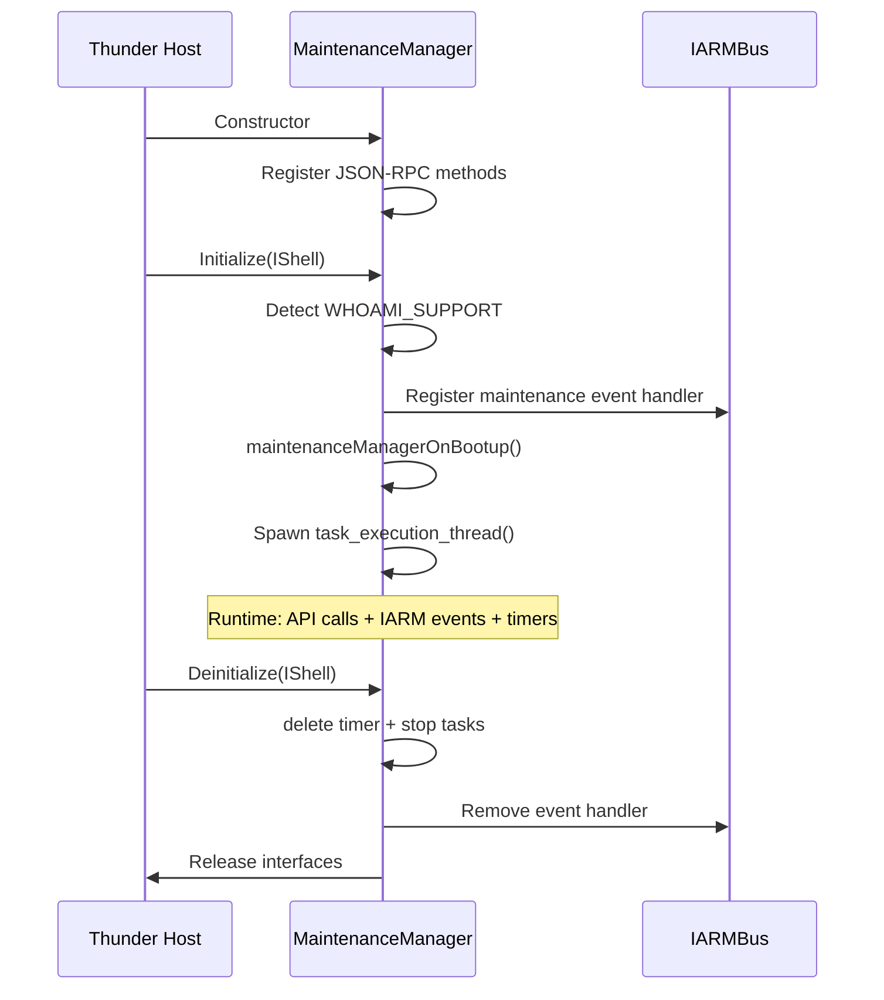
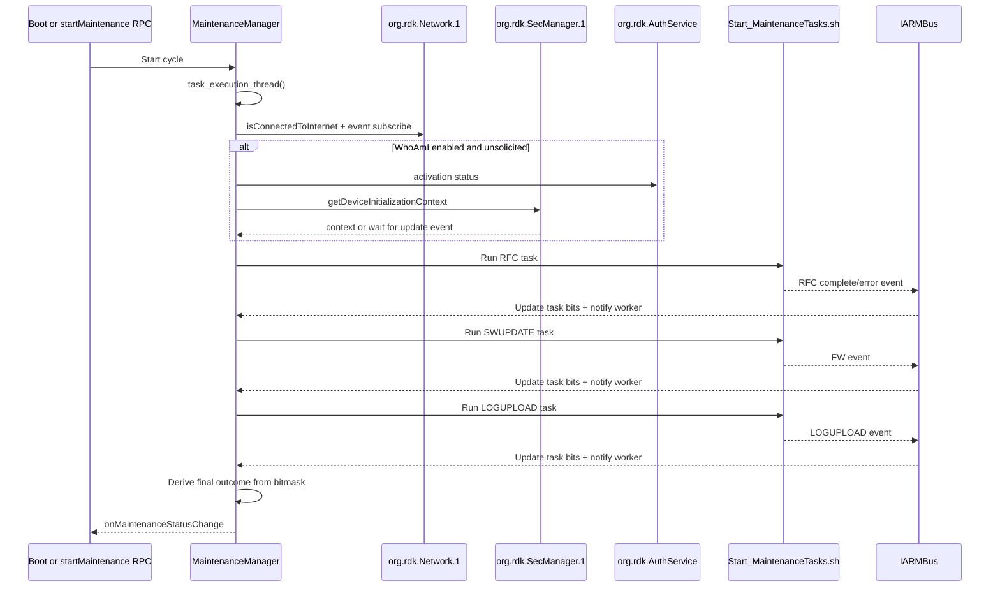
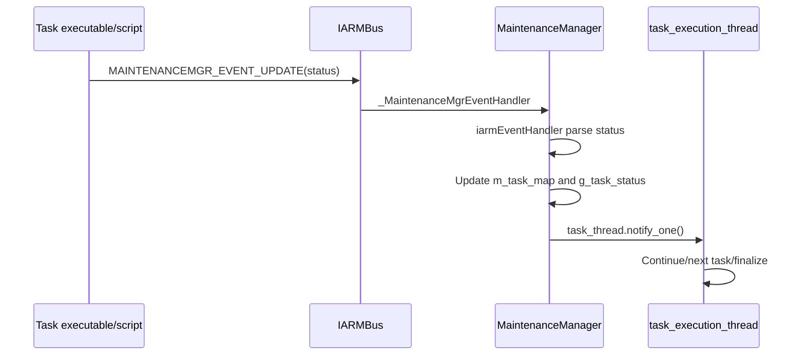
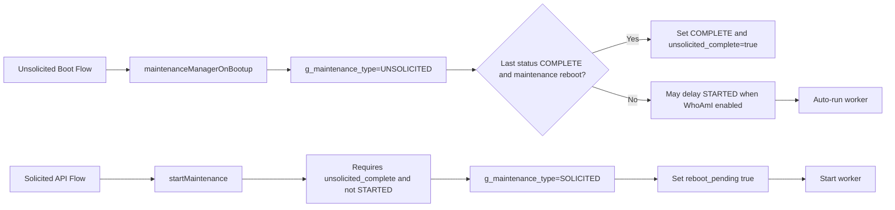
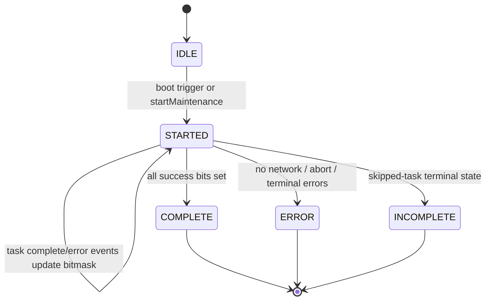

# Runtime Sequence and State Diagrams

## Plugin Lifecycle Sequence



## Initialization Flowchart

```mermaid
flowchart TD
    A[Initialize()] --> B[Store IShell and AddRef]
    B --> C{WHOAMI_SUPPORT true?}
    C -- Yes --> D[subscribeToDeviceInitializationEvent]
    C -- No --> E[Skip pre-subscribe]
    D --> F[InitializeIARM]
    E --> F
    F --> G[Register IARM maintenance event handler]
    G --> H[maintenanceManagerOnBootup]
    H --> I[Set default state and UNSOLICITED type]
    I --> I1{Skip unsolicited?}
    I1 -- Yes --> I2[Post MAINTENANCE_COMPLETE and set unsolicited_complete]
    I1 -- No --> J[Emit MAINTENANCE_IDLE notification]
    J --> K[Start worker thread]
    I2 --> L[Register SIGALRM handler]
    K --> L[Register SIGALRM handler]
    L --> M[Initialize success]
```

## Maintenance Execution Sequence



## IARMBus Event Handling Sequence



## Solicited vs Unsolicited Flow Comparison



## Task-Orchestration State Transition Diagram


